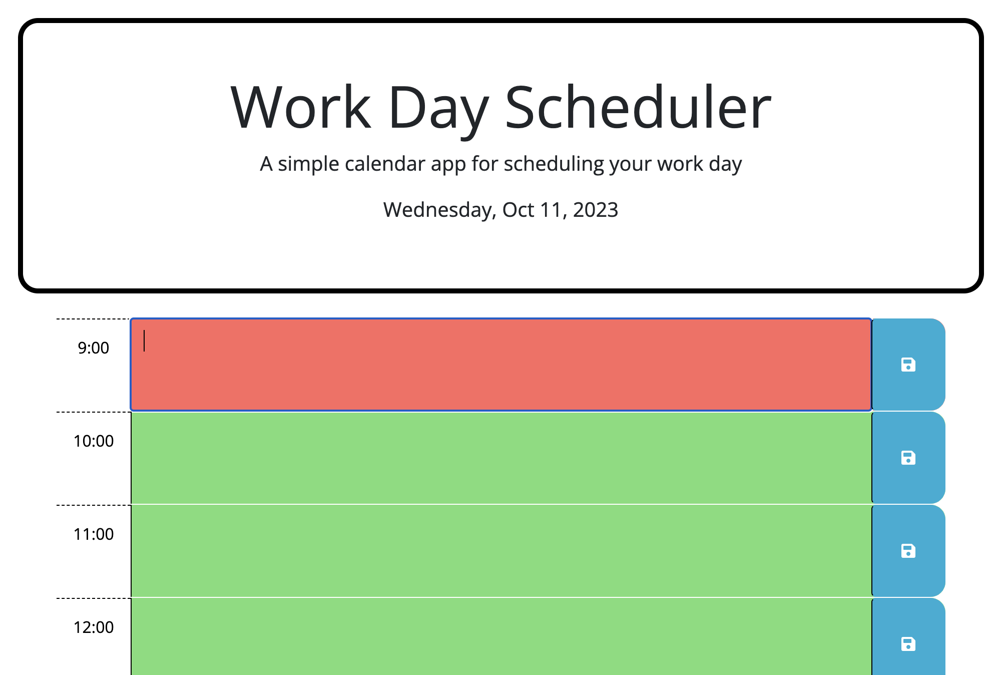

# Day Planner Assignment

#### Acceptance criteria for this assignment:

* GIVEN I am using a daily planner to create a schedule
* WHEN I open the planner
* THEN the current day is displayed at the top of the calendar
* WHEN I scroll down
* THEN I am presented with timeblocks for standard business hours of 9am&ndash;5pm
* WHEN I view the timeblocks for that day
* THEN each timeblock is color coded to indicate whether it is in the past, present, or future
* WHEN I click into a timeblock
* THEN I can enter an event
* WHEN I click the save button for that timeblock
* THEN the text for that event is saved in local storage
* WHEN I refresh the page
* THEN the saved events persist

#### The app functions to accoridng to the above instructions. I also made minor changes to the CSS file to change the way the header was displayed. 

[Link to deployed GitHub Pages](https://lrltillman.github.io/day-planner/)

#### Screenshot of quiz:

#### Received assistance from tutor Sandra Smith and classmate Arthur H. 